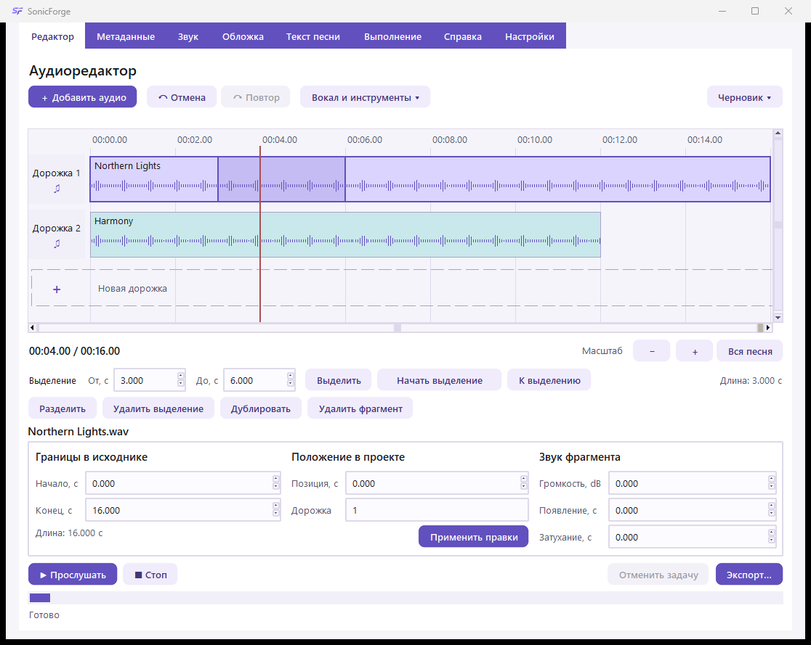
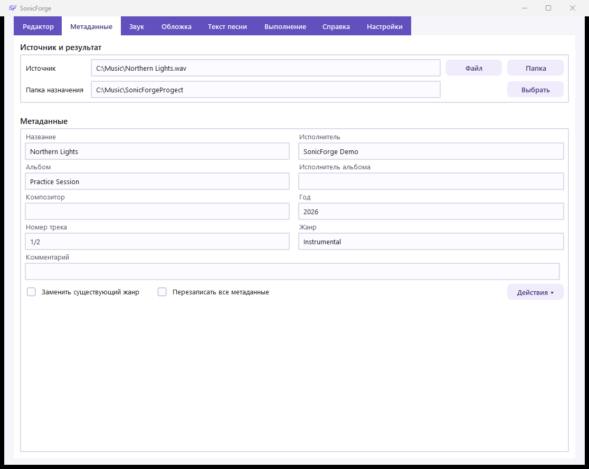
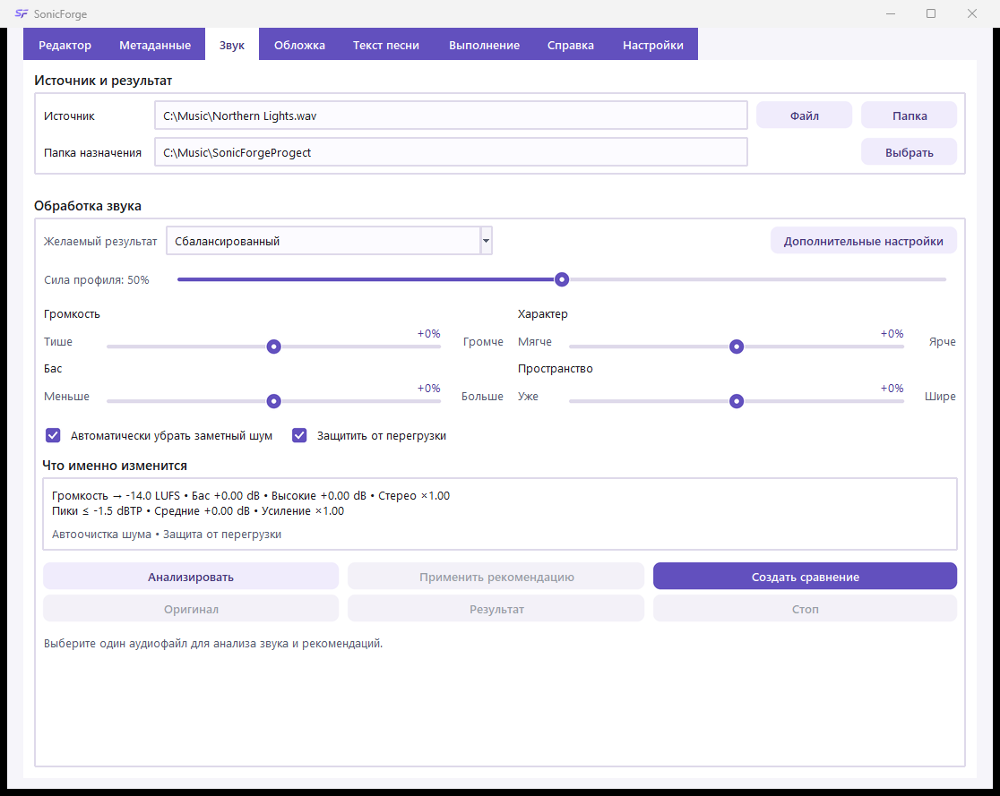
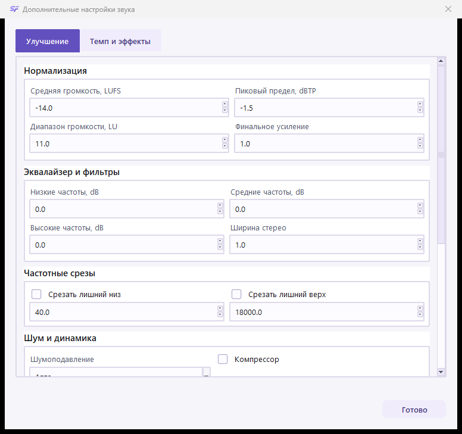
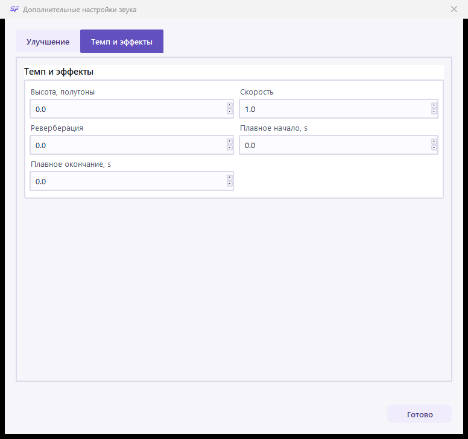
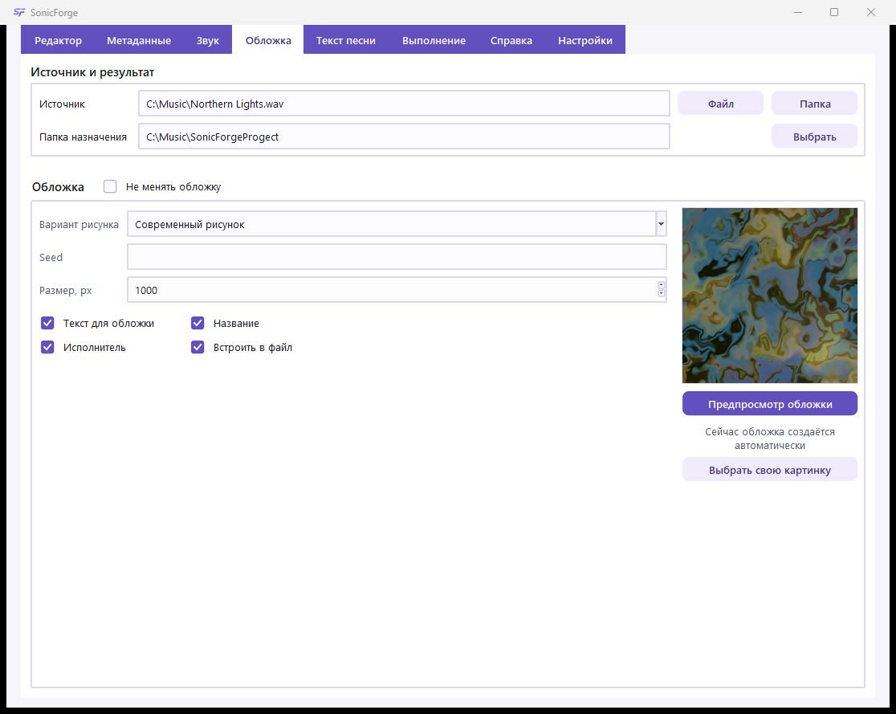
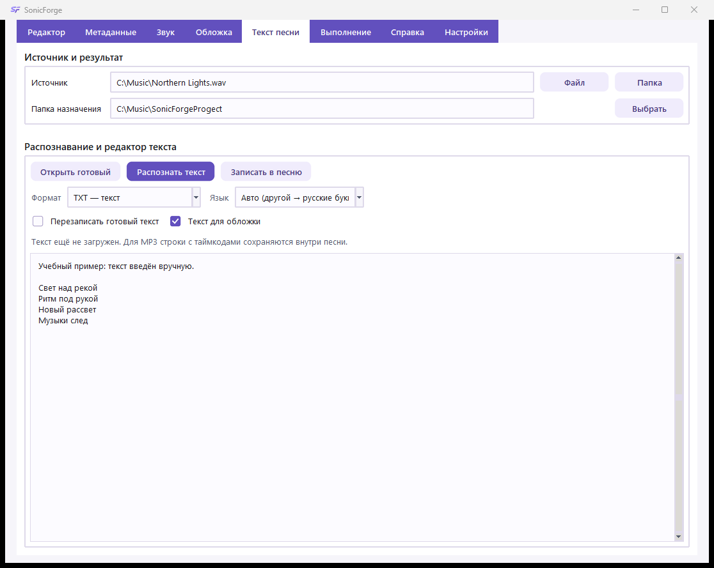
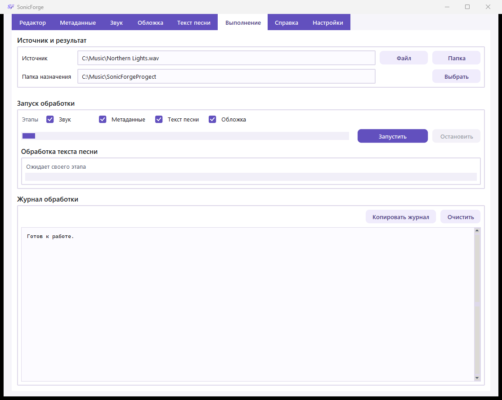
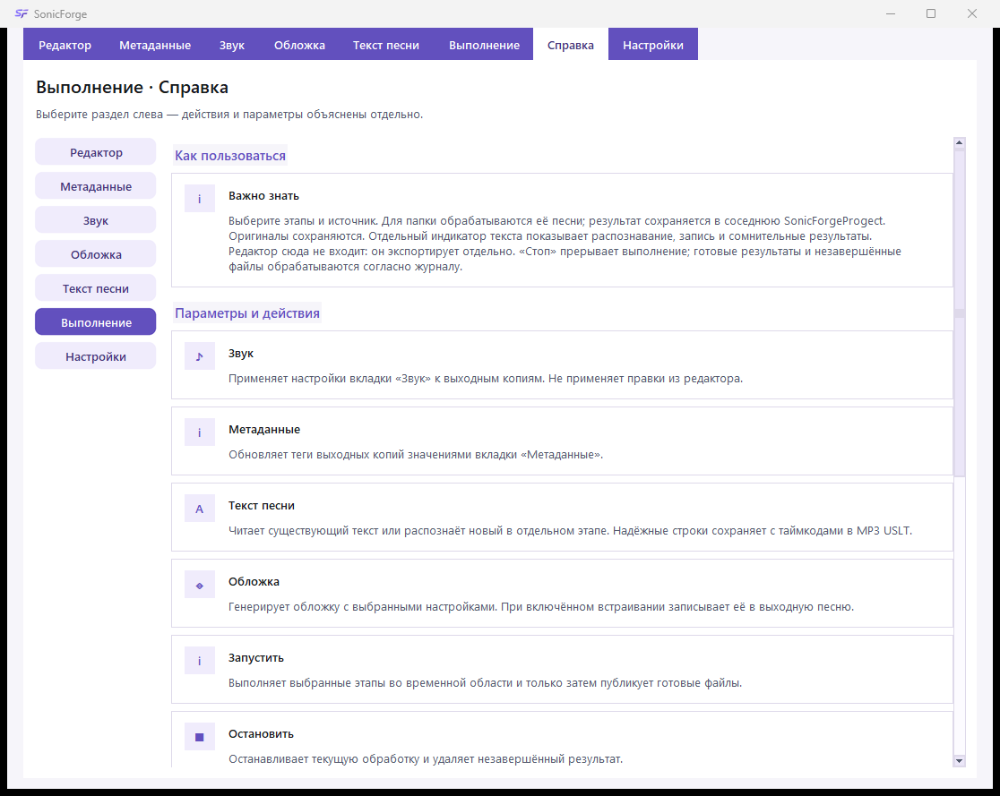
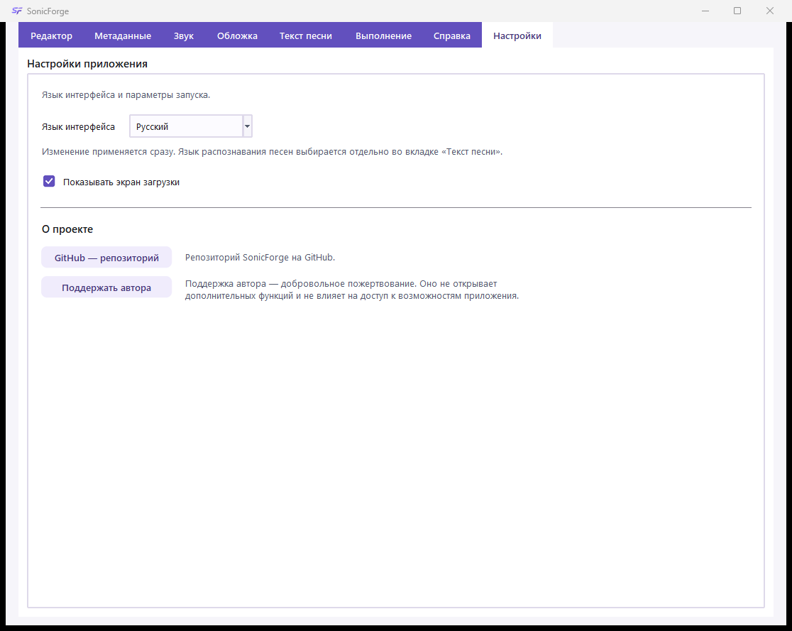

# SonicForge 2.0 · Кузница Звука

[English guide](README.en.md) · [Скачать для Windows](https://github.com/dumuzeyn/SonicForge/releases/tag/v2.0.0) · [Лицензия](LICENSE)

Настольное приложение для редактирования аудио, подготовки копий музыкальных файлов, метаданных, текста песни и обложек. Автор: Зейналов У.Р.о. (Dumuzeyn).

## Установка и первый запуск

1. На странице релиза скачайте **SonicForge-Setup-2.0.0.exe** и запустите установщик. Это полноценный установщик, а не одинокий EXE без библиотек.
2. Выберите папку установки; ярлык рабочего стола можно включить отдельно. Права администратора обычно не нужны: установка выполняется для текущего пользователя.
3. Запустите SonicForge. Для обработки звука и создания обложек отдельно устанавливать Python и FFmpeg не требуется.
4. Для смены языка откройте «Настройки». Справка доступна в верхней полосе и по F1.

Windows x64. Сборка рассчитана на Windows 10/11. Установщик добавляет «Открыть с помощью» для MP3, WAV, FLAC, M4A, AAC, OGG, OPUS и WMA, но не меняет приложение по умолчанию.

Портативная сборка, если приложена к релизу: распакуйте архив целиком и откройте **SonicForge/SonicForge.exe**. Папку **_internal** нельзя удалять или отделять от EXE.

## Два независимых способа работы

| Задача | Где выполнять | Как получить результат |
| --- | --- | --- |
| Монтаж, несколько дорожек, разрезы, микширование | «Редактор» | «Экспорт…» |
| Изменение звука, тегов, текста и обложек одного файла или папки | Настройте соответствующие разделы, затем «Выполнение» | «Запустить» |
| Только прослушать изменение звука | «Звук» | «Создать сравнение», затем «Оригинал» / «Результат» |
| Посмотреть обложку | «Обложка» | «Предпросмотр обложки» |
| Записать вручную исправленный текст в выбранную песню | «Текст песни» | «Записать в песню» |

Файлы в редакторе не становятся источником пакетной обработки. Настройки раздела «Звук» не применяются к редактору. Предпросмотры не запускают «Выполнение».

## Аудиоредактор

На скриншоте — синтетическая учебная запись, не чужая песня. Оба фрагмента начинаются с нуля; красный курсор стоит на 4-й секунде, выделен диапазон 3–6 секунд.

### Добавление и шкала

«Добавить аудио» принимает один или несколько файлов: каждая песня появляется на новой дорожке с отметки 0. Перетаскивание из Проводника на дорожку размещает файл около точки броска; область «Новая дорожка» создаёт следующую дорожку. На одной дорожке фрагменты не перекрываются: занятая область сдвигает новый фрагмент к свободному месту справа.

Горизонтальная ось — время проекта. Вертикальные деления помогают сопоставить моменты разных дорожек. Волновая форма показывает амплитудную огибающую: высокий участок обычно громче, но это **не спектр, не текст песни и не точное измерение LUFS**. Пустая область — отсутствие фрагментов. Номер дорожки и значок ноты относятся ко всей дорожке; щелчок по номеру включает/выключает её звук. Выключенная дорожка не входит в микс.

| Инструмент | Действие |
| --- | --- |
| Щелчок по фрагменту | Выбирает его и ставит красный курсор — позицию разреза и начала прослушивания |
| Перетаскивание фрагмента | Меняет его положение, в том числе переносит на другую дорожку; звук не разрезается |
| Shift + перетаскивание | Выделяет диапазон внутри выбранного фрагмента |
| «От», «До», «Выделить» | Задают точные границы от начала фрагмента, в секундах, с шагом 0,001 с |
| «Начать выделение» | Отмечает курсор как начало; повторное нажатие «Завершить выделение» задаёт конец, в том числе при воспроизведении |
| «К выделению» | Приближает выбранный диапазон |
| «−», «+», «Вся песня» | Меняют масштаб отображения; звук и длительность не меняются |
| «Разделить» | Делит выбранный фрагмент у курсора на два |
| «Удалить выделение» | Вырезает диапазон и соединяет оставшиеся части без паузы, со сглаживанием до 40 мс для уменьшения щелчка |
| «Дублировать» | Создаёт копию фрагмента в проекте |
| «Удалить фрагмент» | Убирает фрагмент из проекта, не удаляет файл с диска |
| «Отмена», «Повтор» | Перемещаются по истории правок проекта |

Счётчик под шкалой — текущая позиция / длина проекта, а не время до окончания обработки. Полосы прокрутки перемещают видимую часть шкалы. Выделение — визуальная область выбранного времени, не отдельная звуковая дорожка.

### Панель выбранного фрагмента

| Поле | Значение |
| --- | --- |
| «Начало», «Конец» | Границы звука в исходном файле; скрытая часть не удаляется из оригинала |
| «Позиция» | Время начала фрагмента на общей шкале проекта |
| «Дорожка» | Номер дорожки, начиная с 1 |
| «Громкость, dB» | Усиление фрагмента: 0 — без изменения, отрицательное — тише, положительное — громче |
| «Появление, с», «Затухание, с» | Плавное нарастание / уменьшение громкости по краям фрагмента |
| «Применить правки» | Подтверждает изменения в этой панели; изменённые числа сами по себе не являются экспортом |

«Прослушать» собирает временный микс с позиции курсора. «Стоп» останавливает звук. «Отменить задачу» прекращает текущую фоновую операцию редактора. Подготовка волновой формы, предпросмотра и экспорта выполняется отдельно от главного интерфейса.

### Вокал, инструменты, черновик и экспорт

«Вокал и инструменты» предлагает два варианта: вокал + инструментарий или вокал + ударные + бас + остальное. Выбранный фрагмент заменяется составляющими на отдельных дорожках с общей позицией. Отмена возвращает исходный фрагмент одним действием. Разделение выполняется локальным модулем и может занять несколько минут; примеси инструментов и артефакты возможны. Это не гарантированное восстановление студийных дорожек. Результаты хранятся в пользовательской папке SonicForge/editor-stems.

Меню «Черновик» сохраняет/открывает **.sfproject**: это описание монтажа и пути к исходникам, **не копия аудио**. Не перемещайте и не удаляйте связанные исходники. «Экспорт…» создаёт новый WAV, MP3 или M4A, смешивая включённые дорожки; экспорт редактора использует 44,1 kHz, стерео и ограничение пиков. Существующий выходной файл и исходник не перезаписываются.

| Клавиши | Действие |
| --- | --- |
| Ctrl+I | Добавить аудио |
| Ctrl+K | Разделить у курсора |
| Ctrl+Shift+X | Удалить выделение |
| Ctrl+D / Delete | Дублировать / удалить фрагмент |
| Ctrl+Z / Ctrl+Y или Ctrl+Shift+Z | Отменить / повторить |
| Ctrl+S / Ctrl+O / Ctrl+E | Сохранить черновик / открыть / экспортировать |
| Ctrl+Shift+V / Ctrl+Shift+B | Разделить на 2 / 4 составляющие |
| Пробел на шкале / Esc | Воспроизведение / остановка и отмена незавершённого выделения или задачи |

Сочетания поддерживают русскую раскладку. В текстовых полях сохраняются обычные действия редактирования текста.

## Источник и папка результата

В разделах пакетных инструментов сверху находится блок «Источник и результат».

- «Файл» выбирает одну песню; «Папка» — каталог для обработки поддерживаемых файлов.
- «Папка назначения» задаёт место для готовых копий. «Выбрать» меняет его вручную.
- По умолчанию создаётся соседняя **SonicForgeProgect** — написание сохранено для совместимости: C:\Music\Album → C:\Music\SonicForgeProgect.
- Готовые проекты и рабочие папки исключаются из повторного обхода. Выбор источника не запускает анализ.
- Выходной путь должен отличаться от исходного. При «Выполнении» исходники сохраняются: этапы работают с подготовленными копиями.

Исключение по записи: кнопка «Записать в песню» в редакторе текста намеренно меняет теги выбранного MP3. Работайте с копией, если хотите сохранить прежний текст.

## Метаданные

«Метаданные» — информация в файле, а не имя файла и не правки звуковой дорожки. Заполните нужные поля и включите этап «Метаданные» во «Выполнении».

| Поле | Для чего |
| --- | --- |
| Название | Название композиции; если не указано, обработка может использовать имя файла |
| Исполнитель | Исполнитель конкретной композиции |
| Альбом | Название альбома |
| Исполнитель альбома | Общий исполнитель релиза; может отличаться от исполнителя песни |
| Композитор | Автор музыки |
| Жанр | Жанровая метка; автоматическое предложение — эвристика, не экспертная классификация |
| Год / дата | Например, 2026 |
| Номер трека | Например, 3 или 3/12 |
| Комментарий | Произвольный текстовый тег; не инструкция генератору обложек |
| Дополнительные поля | Номер диска, издатель, авторские права, дополнительный текстовый тег |

Меню «Действия» позволяет прочитать теги выбранного файла, открыть дополнительные поля или создать копию без метаданных. При обычном обновлении пустые дополнительные поля сохраняют прежние значения. «Перезаписать жанр» разрешает заменить существующую жанровую метку. «Перезаписать все метаданные» удаляет прежние теги и оставляет только заполняемые значения — проверьте этот флажок перед запуском. Для синхронизированного текста используйте отдельный раздел «Текст песни».

## Звук: быстрые настройки и сравнение

1. Выберите один исходный файл.
2. Установите желаемый результат и силу профиля.
3. При необходимости нажмите «Анализировать», затем отдельно «Применить рекомендацию».
4. Нажмите «Создать сравнение» и сравните «Оригинал» / «Результат».
5. Для сохранения готовой копии включите этап «Звук» и запустите «Выполнение».

Анализ измеряет громкость, динамику, частотный баланс и признаки постоянного шума; сам файл не меняется. Рекомендация не применяется автоматически. Для сравнения создаются временные фрагменты примерно до 25 секунд, приведённые к сопоставимой воспринимаемой громкости: это позволяет оценить тембр, а не только эффект «громче значит лучше». После изменения настроек создайте сравнение заново.

| Элемент | Что меняется |
| --- | --- |
| «Сбалансированный» | Нейтральные макропараметры, автоматическая проверка шума |
| «Сохранить характер» | Нейтральный тембр без автоматического шумоподавления; нормализация остаётся |
| «Громче и плотнее» | Более высокая целевая громкость и компрессия, небольшой акцент баса/высоких |
| «Чистый звук» | Автоматическая проверка шума и небольшой сдвиг высоких частот |
| «Больше баса», «Ярче и подробнее», «Шире» | Акцент на низких частотах, высоких частотах или ширине соответственно |
| «Своя настройка» | Ручное положение макроползунков |
| «Сила профиля» | Масштаб действия макроползунков; **0% не выключает всю обработку**: нормализация и отдельно заданные эффекты остаются |
| «Громкость» | Целевая средняя громкость LUFS, не громкость динамиков |
| «Характер» | Усиление/ослабление высоких частот |
| «Бас» | Усиление/ослабление низких частот |
| «Пространство» | Изменение ширины стерео; не превращает моно в настоящую пространственную запись |
| «Автоматически убрать заметный шум» | Включает очистку только при обнаружении признаков постоянного фонового шума |
| «Защитить от перегрузки» | Ограничивает пики; уже записанное искажение исходника не восстанавливает |

Ползунки показывают относительный сдвиг, а не спектрограмму. Блок «Что именно изменится» выводит **реальные** LUFS, dB, dBTP, ширину стерео и активные эффекты. Значения около нуля LUFS означают большую громкость; 0 dB эквалайзера — нейтрально; ×1.00 стерео и усиления — без такого изменения. Предупреждения нельзя трактовать как гарантию качества.

### Дополнительные настройки: улучшение

Окно прокручивается: ниже видны шум, компрессор и формат результата.

| Параметр | Смысл и начальная точка |
| --- | --- |
| Средняя громкость, LUFS | Цель нормализации, по умолчанию −14; не требует максимальной громкости |
| Пиковый предел, dBTP | Цель ограничения истинных пиков, по умолчанию −1,5 |
| Диапазон громкости, LU | Целевая динамика, по умолчанию 11; меньшая величина означает более ровную запись, но это не гарантия точного измеренного LRA |
| Финальное усиление | Множитель после нормализации, по умолчанию 1; увеличение может приблизить звук к лимитеру |
| Низкие / средние / высокие, dB | Полочные фильтры около 110 и 7200 Hz и среднечастотный фильтр около 1100 Hz; 0 сохраняет баланс, кнопка сброса возвращает нейтральное значение |
| Ширина стерео | 0–2, исходная ширина 1; слишком широкая обработка может ухудшить моносовместимость |
| Срез снизу / сверху, Hz | High-pass убирает частоты ниже порога; low-pass — выше. Число действует только при включённом флажке |
| Шумоподавление | Выкл., авто или вручную; сильная очистка может добавить артефакты |
| Компрессор | Уменьшает разницу между громкими и тихими участками, не удаляет шум |
| Порог, dB | Уровень начала компрессии |
| Соотношение | Степень подавления превышения: 3:1 сильнее 1,5:1 |
| Атака / восстановление, ms | Скорость начала и отпускания компрессии; это миллисекунды, не секунды |
| Компенсация, dB | Дополнительное усиление после компрессии |
| Частота дискретизации | Как в оригинале, 44,1 или 48 kHz; неподдерживаемая MP3 частота приводится к ближайшей допустимой |
| Каналы | Как в оригинале, моно или стерео; дублирование моно не создаёт пространственной информации |
| Качество MP3 | Максимальное (VBR q0), высокое (VBR q2), среднее (192 kbit/s); более высокий битрейт не восстановит утраченную информацию |

Точные правки сохраняются при сравнении и запуске обработки. Однако новый выбор профиля или движение макроползунков намеренно пересчитывает связанные параметры: после этого проверьте сводку.

### Темп и эффекты

| Параметр | Как использовать |
| --- | --- |
| Высота, полутоны | 0 — исходная; +12 / −12 — октава вверх / вниз; длительность компенсируется |
| Скорость | 1 — исходная; 1,1 — быстрее, 0,9 — медленнее; темп меняется с сохранением высоты |
| Реверберация | 0 — выкл.; реализована как короткие отражения/эхо, не полноценная модель концертного зала |
| Плавное начало / окончание, s | Нарастание/затухание громкости за указанное число секунд; выбирайте время меньше длины записи |

Кнопка «Готово» закрывает окно. Все эти параметры относятся к пакетному звуку, не к монтажным фрагментам редактора.

## Обложка: генерация и собственная картинка

Music2Picture анализирует звук и строит процедурную абстрактную графику локально. Анализ спектра, ритма, гармонии и структуры влияет на палитру, плотность, изгибы, зерно и композицию. Это художественная интерпретация, **не научный график спектра и не изображение конкретного сюжета песни**.

| Управление | Действие |
| --- | --- |
| Стиль | Выбирает один из пяти способов сочетания рисунка и палитры |
| Seed | Целое число вариации; при одинаковых исходнике, настройках и версии помогает повторить рисунок |
| Размер, px | Размер стороны квадратного результата; увеличение не добавляет деталей исходной пользовательской фотографии |
| «Текст для обложки» | Учитывает готовый текст песни при выборе настроения/цветов; выключение исключает его из анализа |
| «Название» | Центральная надпись из метаданных или имени файла |
| «Исполнитель» | Дополнительная надпись при включённом названии |
| «Встроить в файл» | Записывает картинку в выходную песню при выполнении этапа обложки |
| «Не менять обложку» | Сохраняет имеющуюся обложку вместо её замены |
| «Предпросмотр обложки» | Показывает уменьшенный вариант, не меняет исходник |
| «Выбрать свою картинку» | Принимает PNG, JPEG, WebP; проверяет изображение, приводит к квадрату выбранного размера |
| «Использовать генерацию» | Возвращает автоматический источник после выбора своей картинки |

Пять стилей: современный рисунок; современный рисунок с классическими цветами; смесь обоих рисунков 50/50; классический узор с современными цветами; классический Music2Picture. Классический вариант основан на [закреплённой версии Music2Picture](https://github.com/dumuzeyn/Music2Picture/tree/342013aaa8bdb4cb86c8c14fec0acb038e50b5ca).

Настроение задаётся внутренней автоматической обработкой: в текущем окне нет поля ручного описания сцены. Своя картинка заменяет генерацию; параметры генератора для неё не применяются, оригинальное изображение не меняется. При «Выполнении» полный PNG сохраняется в папке covers; при включённом встраивании он добавляется к выходному аудио. Предпросмотр ещё не означает, что картинка записана в песню.

## Текст песни

1. Выберите один файл в блоке источника.
2. «Открыть готовый» читает текст из тегов или соседнего TXT/LRC без повторного распознавания.
3. «Распознать» запускает локальную обработку звука; строки появляются по мере работы.
4. Проверьте слова вручную. Двойной щелчок выделяет слово с учётом Unicode, апострофов и дефисов; Ctrl+A/C/X/V/Z работают и в русской раскладке.
5. Сохраните исправленный текст кнопкой «Записать в песню» / сохранения.

| Настройка | Значение |
| --- | --- |
| Авто | Русский и английский сохраняются; остальные языки по умолчанию выводятся русскими буквами |
| Русский / English | Принудительно выбирает язык распознавания |
| Другой → английские / русские буквы | Выбирает алфавит приближённой записи звучания иностранных слов |
| Формат для MP3 | Текст внутри ID3 USLT; временные строки могут храниться в виде [mm:ss.xx] |
| TXT для других форматов | Обычный текст рядом с выходным файлом |
| LRC для других форматов | Строки с временными отметками; если времён нет, точную синхронизацию вручную введённого текста создать нельзя |
| «Перезаписать текст» | Разрешает пакетной обработке заменить существующий текст |
| «Текст для обложки» | Использует проверенный/готовый текст при создании обложки |

Транскрипция — **не перевод** и не гарантированно точная фонетическая запись. Неуверенный язык, неоднозначное произношение и смешанные языки требуют проверки. Вероятность языка в статусе не является точностью каждого слова.

Обработка выполняется через faster-whisper с моделью large-v3-turbo. Первая попытка требует сети для скачивания примерно 1,6 ГБ; затем используется локальный кэш. Для грузинского акустического прохода может потребоваться отдельная загрузка примерно 1,6 ГБ. Локальный языковой классификатор и модуль разделения вокала входят в установщик. Открытие приложения само по себе не запускает эти инструменты и не загружает модель распознавания в память. Аудио не отправляется на сервер распознавания.

Сомнительное вступление и слова перепроверяются на сдвинутых участках; повторяющиеся припевы могут использоваться для проверки слабых слов. Это снижает число лишних вставок, но не гарантирует безошибочную расшифровку. CPU-обработка может занимать несколько минут. При неуверенном результате приложение предупреждает о необходимости проверки, а не автоматически объявляет текст правильным.

Сохранение MP3 обновляет только текстовые ID3-кадры и сохраняет звуковые байты, обложку и прочие кадры. Поддерживаются обычные ID3v2.3/v2.4; сложные/повреждённые заголовки отклоняются для записи, чтобы не потерять чужие теги. Ручные строки без времени сохраняются без выдуманных таймкодов. USLT с отметками не равно стандартному SYLT: не каждый музыкальный плеер покажет синхронизацию.

## Выполнение: сохранить подготовленные копии

1. Проверьте источник и папку назначения.
2. Выберите только нужные этапы: «Звук», «Метаданные», «Текст песни», «Обложка».
3. Уточните настройки этих разделов. Правки редактора сюда не входят.
4. Нажмите «Запустить», дождитесь сообщения о завершении и проверьте журнал.
5. Откройте папку результата, послушайте выходные файлы и проверьте теги.

Обработка использует временную рабочую папку. Готовые результаты публикуются в папку назначения после выбранных этапов; исходники не перезаписываются. Этап звука преобразует выходные файлы в MP3. Если звук не выбран, подготавливаются копии исходных файлов для остальных этапов. Обложки сохраняются отдельно в covers.

Верхний движущийся индикатор — признак работы, **не точный процент и не прогноз времени**. Отдельный блок текста показывает подготовку, загрузку, определение языка, распознавание, перепроверку и запись; процент распознавания приблизительно связан с обработанным временем аудио. Итоговые счётчики различают записанный текст, сохранённый готовый текст, требующие проверки записи и ошибки. «Нужна проверка» не означает, что корректный текст уже встроен.

«Стоп» запрашивает отмену. Уже завершённые операции не становятся автоматически отменёнными; смотрите журнал и выходную папку. «Копировать журнал» копирует видимые сообщения, «Очистить журнал» убирает их из окна, не удаляет файлы.

## Справка и настройки

Верхний раздел «Справка» содержит инструкции по выбранной теме. F1 открывает отдельное окно по текущему инструменту. Правый щелчок на элементе показывает его описание; повторный — закрывает подсказку. Подсказки не требуют случайного наведения мыши.

В «Настройках» русский/английский язык меняется сразу, сохраняя проект и введённые параметры. Это **не язык распознавания песни**. Флажок загрузочного экрана действует при следующих запусках; прозрачная заставка использует ту же иконку приложения.

Кнопки проекта открывают репозиторий и страницу поддержки во внешнем браузере только по нажатию. Адреса не занимают место в интерфейсе. Поддержка автора — **добровольное пожертвование**, не открывающее дополнительных функций и не меняющее доступ к инструментам.

## Безопасность и ограничения

Принимаются только заявленные аудиоформаты и PNG/JPEG/WebP для собственной обложки. Проверяются тип локального файла, расширение и сигнатура; ссылки и устройства отклоняются. Для картинки действуют ограничения 50 МБ и 50 миллионов пикселей, проверяется структура. Внешние инструменты получают отдельные аргументы, без запуска через командную оболочку; медиа не исполняются как программы.

Это уменьшает риски, но не делает приложение неуязвимым. Используйте доверенные файлы, сохраняйте резервные копии и обновляйте декодеры. Выбирайте только музыку и изображения, на которые имеете права. Программа не предоставляет права на чужие песни.

Возможные проблемы:

- Нет волновой формы: дождитесь фонового чтения; проверьте файл и сообщение ошибки.
- Кнопки сравнения неактивны: сначала «Создать сравнение» для одного файла.
- Предпросмотр не изменил песню: это ожидаемо; для копии используйте «Выполнение».
- В черновике нет звука: восстановите исходные файлы по сохранённым путям.
- Неверный текст или язык: выберите язык вручную, проверьте результат; не воспринимайте оценку как гарантию.
- После новой настройки звук старый: создайте сравнение заново.
- EXE не стартует после переноса: переместите всю портативную папку или установите приложение установщиком.

## Исходники, тесты и сборка

Для запуска из исходников нужен Python 3.12 и FFmpeg в PATH:

~~~powershell
python -m pip install -r requirements.txt
python music_polisher_gui.py
~~~

Для тестов:

~~~powershell
python -m pip install -r requirements-dev.txt
python -m unittest discover -s tests
~~~

Для Windows-сборки нужен Inno Setup 6. Текущий профиль использует FFmpeg из C:\ffmpeg с его LICENSE и README. Отдельный CPU-модуль разделения собирается в изолированном окружении:

~~~powershell
.\build_windows.ps1
~~~

Результаты: dist\SonicForge\SonicForge.exe вместе с _internal и **dist\SonicForge-Setup-2.0.0.exe**. Скрипт не закрывает насильно открытый портативный проект. Служебные сборки, локальные проверки, кэши и бинарные релизы не коммитятся в исходный репозиторий.

Командные инструменты: easy_music_process.py — полная обработка; music2picture.py covers / describe — обложки и описания; music_metadata.py — метаданные. Для параметров используйте --help. Ключи, меняющие файлы, применяйте сначала на копиях.

Скриншоты воспроизводятся scripts/capture_readme_screenshots.py: создаётся отдельное тестовое окно, синтетическое аудио и собственные учебные строки. Скрипт не открывает пользовательские проекты и не запускает распознавание.

## Лицензия и автор

Собственные код, графика и документация распространяются по [SonicForge Noncommercial and Educational License](LICENSE): разрешены личное некоммерческое использование, изучение, обучение, изменения и некоммерческое распространение с сохранением лицензии. Для коммерческого использования нужно письменное разрешение автора. Это не open-source лицензия без ограничений.

Сторонние компоненты сохраняют свои лицензии и права; ограничение SonicForge на них не переносится. См. [перечень компонентов и уведомления](THIRD_PARTY_NOTICES.md). Автор: **Зейналов У.Р.о. / Dumuzeyn**.
