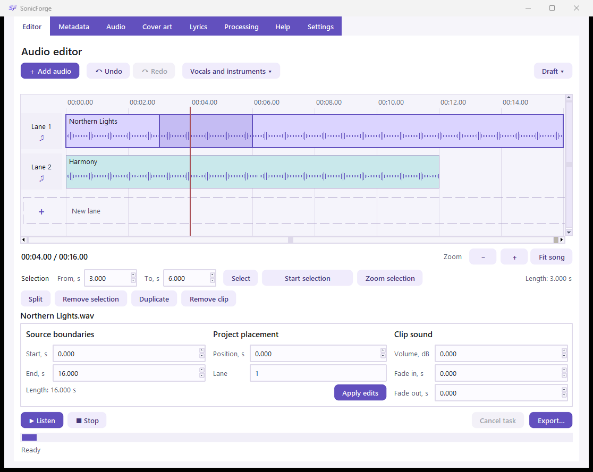
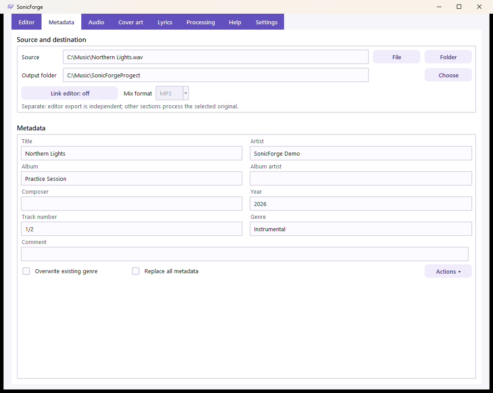
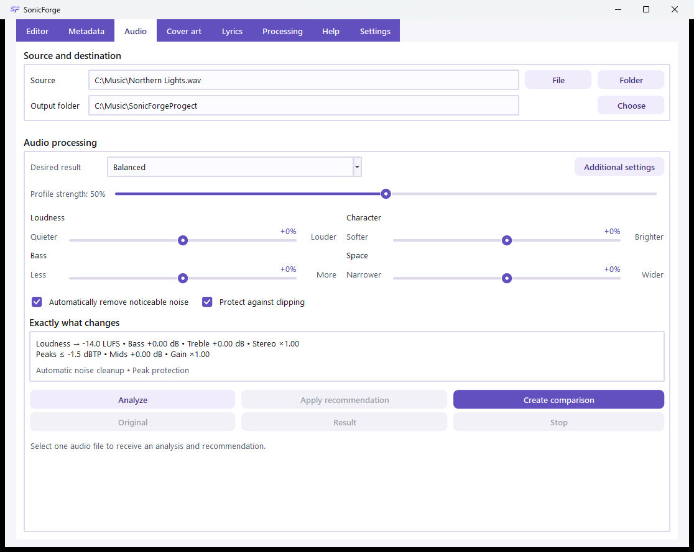
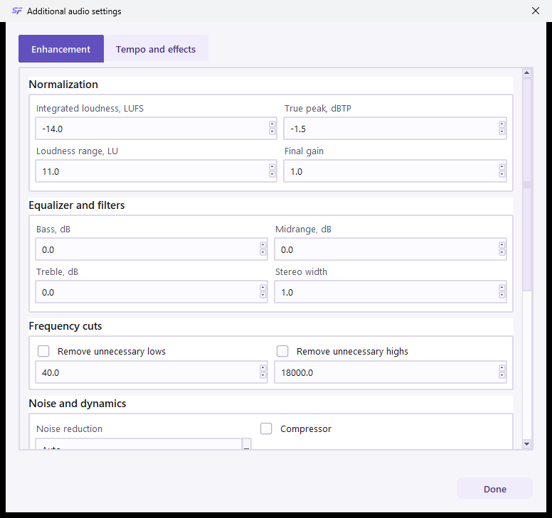
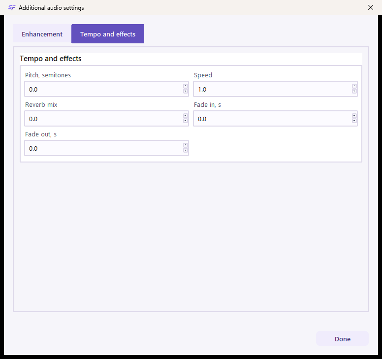
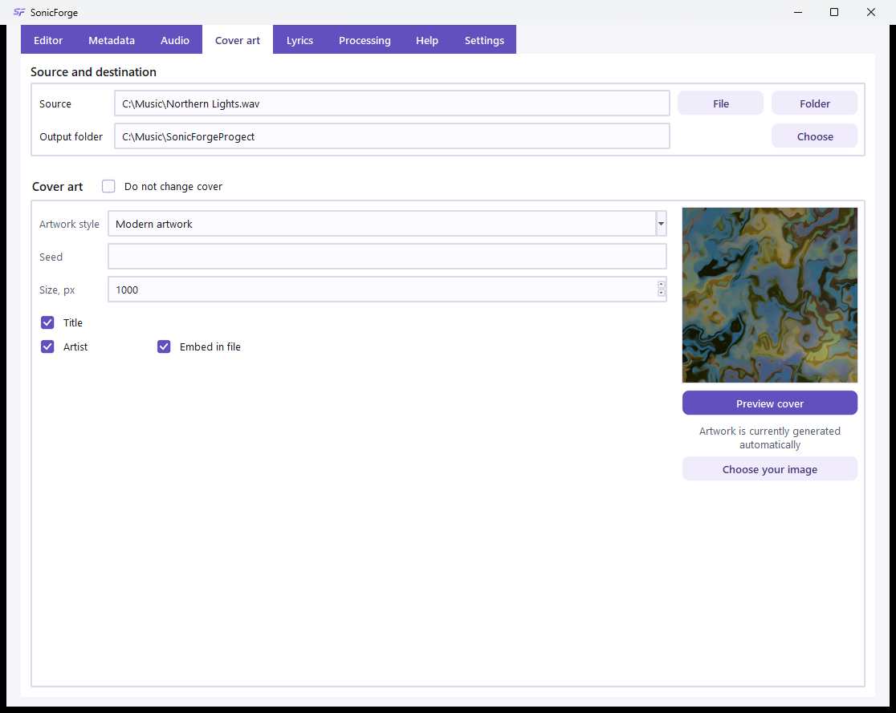
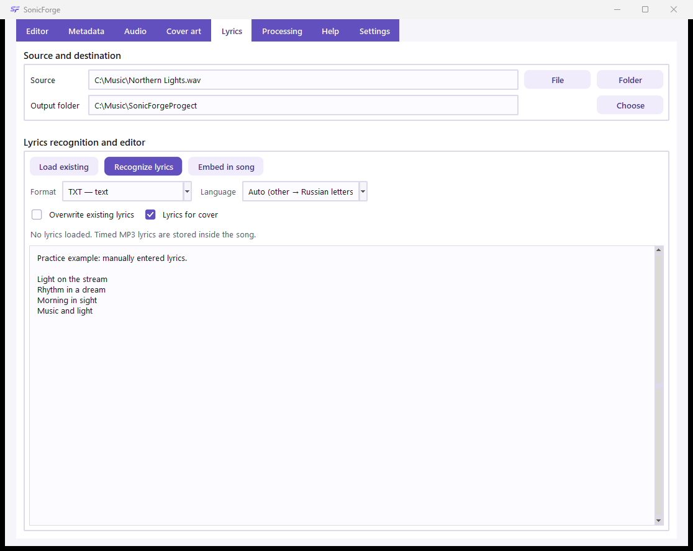
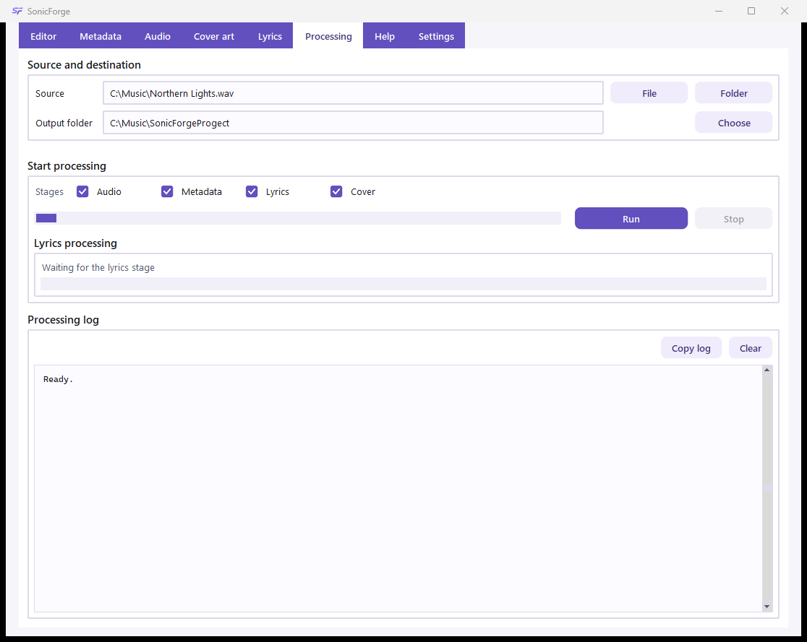
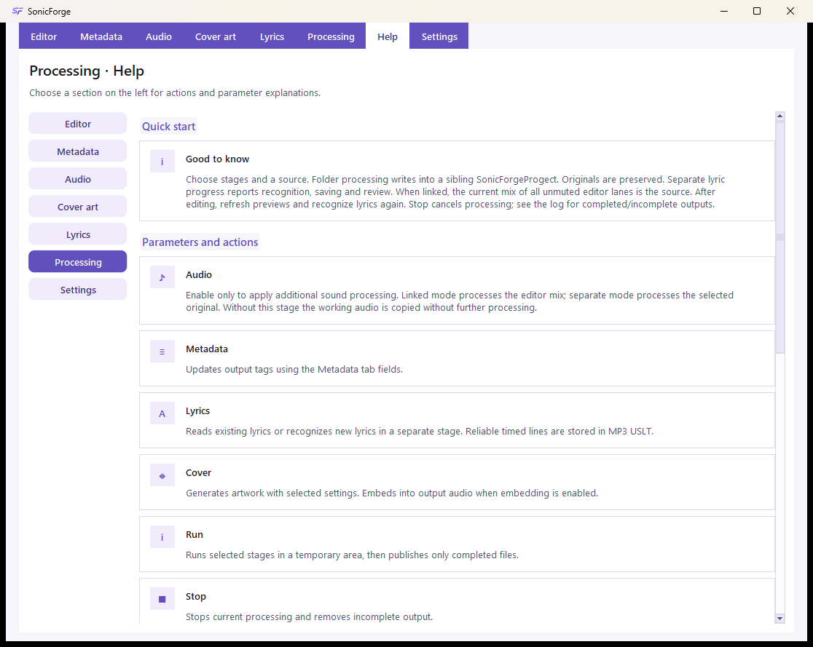
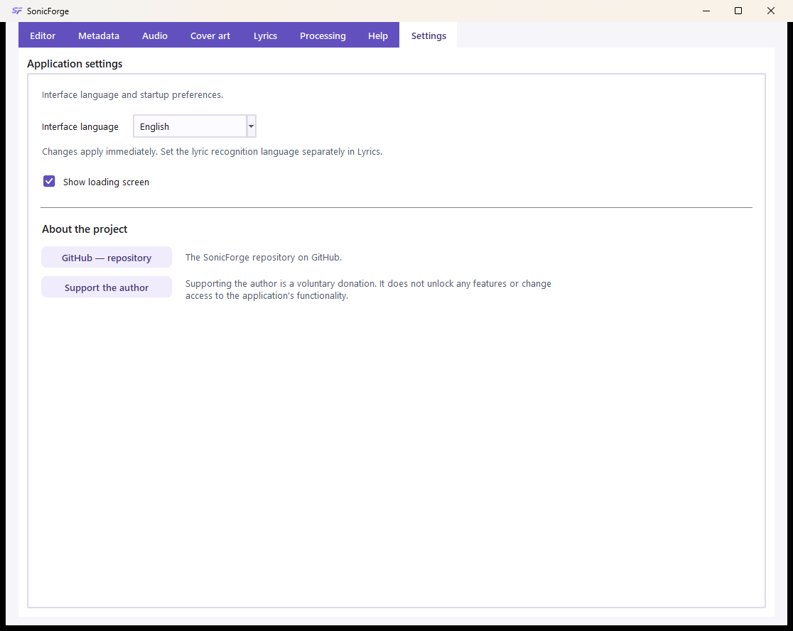

<h1 align="center">SonicForge 2.0 · Кузница Звука</h1>

Настольный аудиоредактор: дорожки, звук, метаданные, текст песни и обложки.

  
  
  

  
  
  

## Установка и первый запуск

1. На странице релиза скачайте **SonicForge-Setup-2.0.0.exe** и запустите установщик. Это полноценный установщик, а не одинокий EXE без библиотек.
2. Выберите папку установки; ярлык рабочего стола можно включить отдельно. Права администратора обычно не нужны: установка выполняется для текущего пользователя.
3. Запустите SonicForge. Для обработки звука и создания обложек отдельно устанавливать Python и FFmpeg не требуется.
4. Для смены языка откройте «Настройки». Справка доступна в верхней полосе и по F1.

Windows x64. Сборка рассчитана на Windows 10/11. Установщик добавляет «Открыть с помощью» для MP3, WAV, FLAC, M4A, AAC, OGG, OPUS и WMA, но не меняет приложение по умолчанию.

Портативная сборка, если приложена к релизу: распакуйте архив целиком и откройте **SonicForge/SonicForge.exe**. Папку **_internal** нельзя удалять или отделять от EXE.

## Два независимых способа работы

| Задача | Где выполнять | Как получить результат |
| --- | --- | --- |
| Монтаж, несколько дорожек, разрезы, микширование | «Редактор» | «Экспорт…» |
| Изменение звука, тегов, текста и обложек одного файла или папки | Настройте соответствующие разделы, затем «Выполнение» | «Запустить» |
| Только прослушать изменение звука | «Звук» | «Создать сравнение», затем «Оригинал» / «Результат» |
| Посмотреть обложку | «Обложка» | «Предпросмотр обложки» |
| Записать вручную исправленный текст в выбранную песню | «Текст песни» | «Записать в песню» |

Файлы в редакторе не становятся источником пакетной обработки. Настройки раздела «Звук» не применяются к редактору. Предпросмотры не запускают «Выполнение».

## Аудиоредактор

На скриншоте — синтетическая учебная запись, не чужая песня. Оба фрагмента начинаются с нуля; красный курсор стоит на 4-й секунде, выделен диапазон 3–6 секунд.

### Добавление и шкала

«Добавить аудио» принимает один или несколько файлов: каждая песня появляется на новой дорожке с отметки 0. Перетаскивание из Проводника на дорожку размещает файл около точки броска; область «Новая дорожка» создаёт следующую дорожку. На одной дорожке фрагменты не перекрываются: занятая область сдвигает новый фрагмент к свободному месту справа.

Горизонтальная ось — время проекта. Вертикальные деления помогают сопоставить моменты разных дорожек. Волновая форма показывает амплитудную огибающую: высокий участок обычно громче, но это **не спектр, не текст песни и не точное измерение LUFS**. Пустая область — отсутствие фрагментов. Номер дорожки и значок ноты относятся ко всей дорожке; щелчок по номеру включает/выключает её звук. Выключенная дорожка не входит в микс.

| Инструмент | Действие |
| --- | --- |
| Щелчок по фрагменту | Выбирает его и ставит красный курсор — позицию разреза и начала прослушивания |
| Перетаскивание фрагмента | Меняет его положение, в том числе переносит на другую дорожку; звук не разрезается |
| Shift + перетаскивание | Выделяет диапазон внутри выбранного фрагмента |
| «От», «До», «Выделить» | Задают точные границы от начала фрагмента, в секундах, с шагом 0,001 с |
| «Начать выделение» | Отмечает курсор как начало; повторное нажатие «Завершить выделение» задаёт конец, в том числе при воспроизведении |
| «К выделению» | Приближает выбранный диапазон |
| «−», «+», «Вся песня» | Меняют масштаб отображения; звук и длительность не меняются |
| «Разделить» | Делит выбранный фрагмент у курсора на два |
| «Удалить выделение» | Вырезает диапазон и соединяет оставшиеся части без паузы, со сглаживанием до 40 мс для уменьшения щелчка |
| «Дублировать» | Создаёт копию фрагмента в проекте |
| «Удалить фрагмент» | Убирает фрагмент из проекта, не удаляет файл с диска |
| «Отмена», «Повтор» | Перемещаются по истории правок проекта |

Счётчик под шкалой — текущая позиция / длина проекта, а не время до окончания обработки. Полосы прокрутки перемещают видимую часть шкалы. Выделение — визуальная область выбранного времени, не отдельная звуковая дорожка.

### Панель выбранного фрагмента

| Поле | Значение |
| --- | --- |
| «Начало», «Конец» | Границы звука в исходном файле; скрытая часть не удаляется из оригинала |
| «Позиция» | Время начала фрагмента на общей шкале проекта |
| «Дорожка» | Номер дорожки, начиная с 1 |
| «Громкость, dB» | Усиление фрагмента: 0 — без изменения, отрицательное — тише, положительное — громче |
| «Появление, с», «Затухание, с» | Плавное нарастание / уменьшение громкости по краям фрагмента |
| «Применить правки» | Подтверждает изменения в этой панели; изменённые числа сами по себе не являются экспортом |

«Прослушать» собирает временный микс с позиции курсора. «Стоп» останавливает звук. «Отменить задачу» прекращает текущую фоновую операцию редактора. Подготовка волновой формы, предпросмотра и экспорта выполняется отдельно от главного интерфейса.

### Вокал, инструменты, черновик и экспорт

«Вокал и инструменты» предлагает два варианта: вокал + инструментарий или вокал + ударные + бас + остальное. Выбранный фрагмент заменяется составляющими на отдельных дорожках с общей позицией. Отмена возвращает исходный фрагмент одним действием. Разделение выполняется локальным модулем и может занять несколько минут; примеси инструментов и артефакты возможны. Это не гарантированное восстановление студийных дорожек. Результаты хранятся в пользовательской папке SonicForge/editor-stems.

Меню «Черновик» сохраняет/открывает **.sfproject**: это описание монтажа и пути к исходникам, **не копия аудио**. Не перемещайте и не удаляйте связанные исходники. «Экспорт…» создаёт новый WAV, MP3 или M4A, смешивая включённые дорожки; экспорт редактора использует 44,1 kHz, стерео и ограничение пиков. Существующий выходной файл и исходник не перезаписываются.

| Клавиши | Действие |
| --- | --- |
| Ctrl+I | Добавить аудио |
| Ctrl+K | Разделить у курсора |
| Ctrl+Shift+X | Удалить выделение |
| Ctrl+D / Delete | Дублировать / удалить фрагмент |
| Ctrl+Z / Ctrl+Y или Ctrl+Shift+Z | Отменить / повторить |
| Ctrl+S / Ctrl+O / Ctrl+E | Сохранить черновик / открыть / экспортировать |
| Ctrl+Shift+V / Ctrl+Shift+B | Разделить на 2 / 4 составляющие |
| Пробел на шкале / Esc | Воспроизведение / остановка и отмена незавершённого выделения или задачи |

Сочетания поддерживают русскую раскладку. В текстовых полях сохраняются обычные действия редактирования текста.

## Источник и папка результата

В разделах пакетных инструментов сверху находится блок «Источник и результат».

- «Файл» выбирает одну песню; «Папка» — каталог для обработки поддерживаемых файлов.
- «Папка назначения» задаёт место для готовых копий. «Выбрать» меняет его вручную.
- По умолчанию создаётся соседняя **SonicForgeProgect** — написание сохранено для совместимости: C:\Music\Album → C:\Music\SonicForgeProgect.
- Готовые проекты и рабочие папки исключаются из повторного обхода. Выбор источника не запускает анализ.
- Выходной путь должен отличаться от исходного. При «Выполнении» исходники сохраняются: этапы работают с подготовленными копиями.

Исключение по записи: кнопка «Записать в песню» в редакторе текста намеренно меняет теги выбранного MP3. Работайте с копией, если хотите сохранить прежний текст.

## Метаданные

«Метаданные» — информация в файле, а не имя файла и не правки звуковой дорожки. Заполните нужные поля и включите этап «Метаданные» во «Выполнении».

| Поле | Для чего |
| --- | --- |
| Название | Название композиции; если не указано, обработка может использовать имя файла |
| Исполнитель | Исполнитель конкретной композиции |
| Альбом | Название альбома |
| Исполнитель альбома | Общий исполнитель релиза; может отличаться от исполнителя песни |
| Композитор | Автор музыки |
| Жанр | Жанровая метка; автоматическое предложение — эвристика, не экспертная классификация |
| Год / дата | Например, 2026 |
| Номер трека | Например, 3 или 3/12 |
| Комментарий | Произвольный текстовый тег; не инструкция генератору обложек |
| Дополнительные поля | Номер диска, издатель, авторские права, дополнительный текстовый тег |

Меню «Действия» позволяет прочитать теги выбранного файла, открыть дополнительные поля или создать копию без метаданных. При обычном обновлении пустые дополнительные поля сохраняют прежние значения. «Перезаписать жанр» разрешает заменить существующую жанровую метку. «Перезаписать все метаданные» удаляет прежние теги и оставляет только заполняемые значения — проверьте этот флажок перед запуском. Для синхронизированного текста используйте отдельный раздел «Текст песни».

## Звук: быстрые настройки и сравнение

1. Выберите один исходный файл.
2. Установите желаемый результат и силу профиля.
3. При необходимости нажмите «Анализировать», затем отдельно «Применить рекомендацию».
4. Нажмите «Создать сравнение» и сравните «Оригинал» / «Результат».
5. Для сохранения готовой копии включите этап «Звук» и запустите «Выполнение».

Анализ измеряет громкость, динамику, частотный баланс и признаки постоянного шума; сам файл не меняется. Рекомендация не применяется автоматически. Для сравнения создаются временные фрагменты примерно до 25 секунд, приведённые к сопоставимой воспринимаемой громкости: это позволяет оценить тембр, а не только эффект «громче значит лучше». После изменения настроек создайте сравнение заново.

| Элемент | Что меняется |
| --- | --- |
| «Сбалансированный» | Нейтральные макропараметры, автоматическая проверка шума |
| «Сохранить характер» | Нейтральный тембр без автоматического шумоподавления; нормализация остаётся |
| «Громче и плотнее» | Более высокая целевая громкость и компрессия, небольшой акцент баса/высоких |
| «Чистый звук» | Автоматическая проверка шума и небольшой сдвиг высоких частот |
| «Больше баса», «Ярче и подробнее», «Шире» | Акцент на низких частотах, высоких частотах или ширине соответственно |
| «Своя настройка» | Ручное положение макроползунков |
| «Сила профиля» | Масштаб действия макроползунков; **0% не выключает всю обработку**: нормализация и отдельно заданные эффекты остаются |
| «Громкость» | Целевая средняя громкость LUFS, не громкость динамиков |
| «Характер» | Усиление/ослабление высоких частот |
| «Бас» | Усиление/ослабление низких частот |
| «Пространство» | Изменение ширины стерео; не превращает моно в настоящую пространственную запись |
| «Автоматически убрать заметный шум» | Включает очистку только при обнаружении признаков постоянного фонового шума |
| «Защитить от перегрузки» | Ограничивает пики; уже записанное искажение исходника не восстанавливает |

Ползунки показывают относительный сдвиг, а не спектрограмму. Блок «Что именно изменится» выводит **реальные** LUFS, dB, dBTP, ширину стерео и активные эффекты. Значения около нуля LUFS означают большую громкость; 0 dB эквалайзера — нейтрально; ×1.00 стерео и усиления — без такого изменения. Предупреждения нельзя трактовать как гарантию качества.

### Дополнительные настройки: улучшение

Окно прокручивается: ниже видны шум, компрессор и формат результата.

| Параметр | Смысл и начальная точка |
| --- | --- |
| Средняя громкость, LUFS | Цель нормализации, по умолчанию −14; не требует максимальной громкости |
| Пиковый предел, dBTP | Цель ограничения истинных пиков, по умолчанию −1,5 |
| Диапазон громкости, LU | Целевая динамика, по умолчанию 11; меньшая величина означает более ровную запись, но это не гарантия точного измеренного LRA |
| Финальное усиление | Множитель после нормализации, по умолчанию 1; увеличение может приблизить звук к лимитеру |
| Низкие / средние / высокие, dB | Полочные фильтры около 110 и 7200 Hz и среднечастотный фильтр около 1100 Hz; 0 сохраняет баланс, кнопка сброса возвращает нейтральное значение |
| Ширина стерео | 0–2, исходная ширина 1; слишком широкая обработка может ухудшить моносовместимость |
| Срез снизу / сверху, Hz | High-pass убирает частоты ниже порога; low-pass — выше. Число действует только при включённом флажке |
| Шумоподавление | Выкл., авто или вручную; сильная очистка может добавить артефакты |
| Компрессор | Уменьшает разницу между громкими и тихими участками, не удаляет шум |
| Порог, dB | Уровень начала компрессии |
| Соотношение | Степень подавления превышения: 3:1 сильнее 1,5:1 |
| Атака / восстановление, ms | Скорость начала и отпускания компрессии; это миллисекунды, не секунды |
| Компенсация, dB | Дополнительное усиление после компрессии |
| Частота дискретизации | Как в оригинале, 44,1 или 48 kHz; неподдерживаемая MP3 частота приводится к ближайшей допустимой |
| Каналы | Как в оригинале, моно или стерео; дублирование моно не создаёт пространственной информации |
| Качество MP3 | Максимальное (VBR q0), высокое (VBR q2), среднее (192 kbit/s); более высокий битрейт не восстановит утраченную информацию |

Точные правки сохраняются при сравнении и запуске обработки. Однако новый выбор профиля или движение макроползунков намеренно пересчитывает связанные параметры: после этого проверьте сводку.

### Темп и эффекты

| Параметр | Как использовать |
| --- | --- |
| Высота, полутоны | 0 — исходная; +12 / −12 — октава вверх / вниз; длительность компенсируется |
| Скорость | 1 — исходная; 1,1 — быстрее, 0,9 — медленнее; темп меняется с сохранением высоты |
| Реверберация | 0 — выкл.; реализована как короткие отражения/эхо, не полноценная модель концертного зала |
| Плавное начало / окончание, s | Нарастание/затухание громкости за указанное число секунд; выбирайте время меньше длины записи |

Кнопка «Готово» закрывает окно. Все эти параметры относятся к пакетному звуку, не к монтажным фрагментам редактора.

## Обложка: генерация и собственная картинка

Music2Picture анализирует звук и строит процедурную абстрактную графику локально. Анализ спектра, ритма, гармонии и структуры влияет на палитру, плотность, изгибы, зерно и композицию. Это художественная интерпретация, **не научный график спектра и не изображение конкретного сюжета песни**.

| Управление | Действие |
| --- | --- |
| Стиль | Выбирает один из пяти способов сочетания рисунка и палитры |
| Seed | Целое число вариации; при одинаковых исходнике, настройках и версии помогает повторить рисунок |
| Размер, px | Размер стороны квадратного результата; увеличение не добавляет деталей исходной пользовательской фотографии |
| «Текст для обложки» | Учитывает готовый текст песни при выборе настроения/цветов; выключение исключает его из анализа |
| «Название» | Центральная надпись из метаданных или имени файла |
| «Исполнитель» | Дополнительная надпись при включённом названии |
| «Встроить в файл» | Записывает картинку в выходную песню при выполнении этапа обложки |
| «Не менять обложку» | Сохраняет имеющуюся обложку вместо её замены |
| «Предпросмотр обложки» | Показывает уменьшенный вариант, не меняет исходник |
| «Выбрать свою картинку» | Принимает PNG, JPEG, WebP; проверяет изображение, приводит к квадрату выбранного размера |
| «Использовать генерацию» | Возвращает автоматический источник после выбора своей картинки |

Пять стилей: современный рисунок; современный рисунок с классическими цветами; смесь обоих рисунков 50/50; классический узор с современными цветами; классический Music2Picture. Классический вариант основан на [закреплённой версии Music2Picture](https://github.com/dumuzeyn/Music2Picture/tree/342013aaa8bdb4cb86c8c14fec0acb038e50b5ca).

Настроение задаётся внутренней автоматической обработкой: в текущем окне нет поля ручного описания сцены. Своя картинка заменяет генерацию; параметры генератора для неё не применяются, оригинальное изображение не меняется. При «Выполнении» полный PNG сохраняется в папке covers; при включённом встраивании он добавляется к выходному аудио. Предпросмотр ещё не означает, что картинка записана в песню.

## Текст песни

1. Выберите один файл в блоке источника.
2. «Открыть готовый» читает текст из тегов или соседнего TXT/LRC без повторного распознавания.
3. «Распознать» запускает локальную обработку звука; строки появляются по мере работы.
4. Проверьте слова вручную. Двойной щелчок выделяет слово с учётом Unicode, апострофов и дефисов; Ctrl+A/C/X/V/Z работают и в русской раскладке.
5. Сохраните исправленный текст кнопкой «Записать в песню» / сохранения.

| Настройка | Значение |
| --- | --- |
| Авто | Русский и английский сохраняются; остальные языки по умолчанию выводятся русскими буквами |
| Русский / English | Принудительно выбирает язык распознавания |
| Другой → английские / русские буквы | Выбирает алфавит приближённой записи звучания иностранных слов |
| Формат для MP3 | Текст внутри ID3 USLT; временные строки могут храниться в виде [mm:ss.xx] |
| TXT для других форматов | Обычный текст рядом с выходным файлом |
| LRC для других форматов | Строки с временными отметками; если времён нет, точную синхронизацию вручную введённого текста создать нельзя |
| «Перезаписать текст» | Разрешает пакетной обработке заменить существующий текст |
| «Текст для обложки» | Использует проверенный/готовый текст при создании обложки |

Транскрипция — **не перевод** и не гарантированно точная фонетическая запись. Неуверенный язык, неоднозначное произношение и смешанные языки требуют проверки. Вероятность языка в статусе не является точностью каждого слова.

Обработка выполняется через faster-whisper с моделью large-v3-turbo. Первая попытка требует сети для скачивания примерно 1,6 ГБ; затем используется локальный кэш. Для грузинского акустического прохода может потребоваться отдельная загрузка примерно 1,6 ГБ. Локальный языковой классификатор и модуль разделения вокала входят в установщик. Открытие приложения само по себе не запускает эти инструменты и не загружает модель распознавания в память. Аудио не отправляется на сервер распознавания.

Сомнительное вступление и слова перепроверяются на сдвинутых участках; повторяющиеся припевы могут использоваться для проверки слабых слов. Это снижает число лишних вставок, но не гарантирует безошибочную расшифровку. CPU-обработка может занимать несколько минут. При неуверенном результате приложение предупреждает о необходимости проверки, а не автоматически объявляет текст правильным.

Сохранение MP3 обновляет только текстовые ID3-кадры и сохраняет звуковые байты, обложку и прочие кадры. Поддерживаются обычные ID3v2.3/v2.4; сложные/повреждённые заголовки отклоняются для записи, чтобы не потерять чужие теги. Ручные строки без времени сохраняются без выдуманных таймкодов. USLT с отметками не равно стандартному SYLT: не каждый музыкальный плеер покажет синхронизацию.

## Выполнение: сохранить подготовленные копии

1. Проверьте источник и папку назначения.
2. Выберите только нужные этапы: «Звук», «Метаданные», «Текст песни», «Обложка».
3. Уточните настройки этих разделов. Правки редактора сюда не входят.
4. Нажмите «Запустить», дождитесь сообщения о завершении и проверьте журнал.
5. Откройте папку результата, послушайте выходные файлы и проверьте теги.

Обработка использует временную рабочую папку. Готовые результаты публикуются в папку назначения после выбранных этапов; исходники не перезаписываются. Этап звука преобразует выходные файлы в MP3. Если звук не выбран, подготавливаются копии исходных файлов для остальных этапов. Обложки сохраняются отдельно в covers.

Верхний движущийся индикатор — признак работы, **не точный процент и не прогноз времени**. Отдельный блок текста показывает подготовку, загрузку, определение языка, распознавание, перепроверку и запись; процент распознавания приблизительно связан с обработанным временем аудио. Итоговые счётчики различают записанный текст, сохранённый готовый текст, требующие проверки записи и ошибки. «Нужна проверка» не означает, что корректный текст уже встроен.

«Стоп» запрашивает отмену. Уже завершённые операции не становятся автоматически отменёнными; смотрите журнал и выходную папку. «Копировать журнал» копирует видимые сообщения, «Очистить журнал» убирает их из окна, не удаляет файлы.

## Справка и настройки

Верхний раздел «Справка» содержит инструкции по выбранной теме. F1 открывает отдельное окно по текущему инструменту. Правый щелчок на элементе показывает его описание; повторный — закрывает подсказку. Подсказки не требуют случайного наведения мыши.

В «Настройках» русский/английский язык меняется сразу, сохраняя проект и введённые параметры. Это **не язык распознавания песни**. Флажок загрузочного экрана действует при следующих запусках; прозрачная заставка использует ту же иконку приложения.

Кнопки проекта открывают репозиторий и страницу поддержки во внешнем браузере только по нажатию. Адреса не занимают место в интерфейсе. Поддержка автора — **добровольное пожертвование**, не открывающее дополнительных функций и не меняющее доступ к инструментам.

## Безопасность и ограничения

Принимаются только заявленные аудиоформаты и PNG/JPEG/WebP для собственной обложки. Проверяются тип локального файла, расширение и сигнатура; ссылки и устройства отклоняются. Для картинки действуют ограничения 50 МБ и 50 миллионов пикселей, проверяется структура. Внешние инструменты получают отдельные аргументы, без запуска через командную оболочку; медиа не исполняются как программы.

Это уменьшает риски, но не делает приложение неуязвимым. Используйте доверенные файлы, сохраняйте резервные копии и обновляйте декодеры. Выбирайте только музыку и изображения, на которые имеете права. Программа не предоставляет права на чужие песни.

Возможные проблемы:

- Нет волновой формы: дождитесь фонового чтения; проверьте файл и сообщение ошибки.
- Кнопки сравнения неактивны: сначала «Создать сравнение» для одного файла.
- Предпросмотр не изменил песню: это ожидаемо; для копии используйте «Выполнение».
- В черновике нет звука: восстановите исходные файлы по сохранённым путям.
- Неверный текст или язык: выберите язык вручную, проверьте результат; не воспринимайте оценку как гарантию.
- После новой настройки звук старый: создайте сравнение заново.
- EXE не стартует после переноса: переместите всю портативную папку или установите приложение установщиком.

## Исходники, тесты и сборка

Для запуска из исходников нужен Python 3.12 и FFmpeg в PATH:

~~~powershell
python -m pip install -r requirements/runtime.txt
python src/music_polisher_gui.py
~~~

Для тестов:

~~~powershell
python -m pip install -r requirements/development.txt
python -m unittest discover -s tests -t .
~~~

Для Windows-сборки нужен Inno Setup 6. Текущий профиль использует FFmpeg из C:\ffmpeg с его LICENSE и README. Отдельный CPU-модуль разделения собирается в изолированном окружении:

~~~powershell
.\scripts\build_windows.ps1
~~~

Результаты: dist\SonicForge\SonicForge.exe вместе с _internal и **dist\SonicForge-Setup-2.0.0.exe**. Скрипт не закрывает насильно открытый портативный проект. Служебные сборки, локальные проверки, кэши и бинарные релизы не коммитятся в исходный репозиторий.

Командные инструменты: `python src/easy_music_process.py` — полная обработка; `python src/music2picture.py covers` / `describe` — обложки и описания; `python src/music_metadata.py` — метаданные. Для параметров используйте --help. Ключи, меняющие файлы, применяйте сначала на копиях.

Структура репозитория:

| Папка | Содержимое |
| --- | --- |
| `src/` | Исходники приложения, интерфейс и инструменты обработки |
| `assets/` | Иконка приложения и шрифты |
| `scripts/` | Сборка, публикация и диагностические проверки |
| `packaging/` | Профили PyInstaller, установщик, версия и уведомления сборки |
| `requirements/` | Зависимости приложения и разработки |
| `tests/` | Автоматические тесты |
| `docs/` | Скриншоты, заметки релиза и лицензии компонентов |
| `tools/` | Служебные инструменты подготовки графики |

Скриншоты воспроизводятся scripts/capture_readme_screenshots.py: создаётся отдельное тестовое окно, синтетическое аудио и собственные учебные строки. Скрипт не открывает пользовательские проекты и не запускает распознавание.

## Лицензия

Собственные код, графика и документация распространяются по [SonicForge Noncommercial and Educational License](LICENSE): разрешены личное некоммерческое использование, изучение, обучение, изменения и некоммерческое распространение с сохранением лицензии. Для коммерческого использования нужно письменное разрешение автора. Это не open-source лицензия без ограничений.

Сторонние компоненты сохраняют свои лицензии и права; ограничение SonicForge на них не переносится. См. [перечень компонентов и уведомления](docs/THIRD_PARTY_NOTICES.md).

## Автор

**Зейналов У.Р.о. / Dumuzeyn** — автор SonicForge.

Поддержка автора — добровольное пожертвование. Оно не открывает никаких функций и не меняет доступ к приложению.

  
  

---

<h1 align="center">SonicForge 2.0 · Sound Forge</h1>

A desktop audio editor: tracks, sound, metadata, lyrics and cover art.

  
  
  

  
  
  

## Install and start

1. Download **SonicForge-Setup-2.0.0.exe** from the release page and run it. This is the complete installer, not a standalone launcher missing its libraries.
2. Select an installation folder. The desktop shortcut is optional. Installation normally requires no administrator rights and is scoped to the current user.
3. Start SonicForge. The packaged application does not require a separate Python or FFmpeg installation for audio processing or artwork.
4. Open Settings to choose the interface language. Use the Help tab or F1 for instructions.

Windows x64; the build targets Windows 10/11. The installer registers Open with for MP3, WAV, FLAC, M4A, AAC, OGG, OPUS and WMA without changing default applications.

If a portable archive is attached, extract the **entire** archive and open **SonicForge/SonicForge.exe**. Keep **_internal** beside the executable.

## Two independent workflows

| Task | Workspace | Output action |
| --- | --- | --- |
| Arrange clips, edit multiple tracks, split and mix | Editor | Export… |
| Process audio, tags, lyrics and covers for a file or folder | Configure the relevant tabs, then Processing | Run |
| Hear an audio setting | Audio | Create comparison → Original / Processed |
| Inspect artwork | Cover art | Preview cover |
| Save manually corrected lyrics into the selected song | Lyrics | Save into song |

Editor tracks are not the batch source. Audio-tab settings do not affect Editor clips. A preview does not start Processing.

## Audio editor

The screenshot uses synthetic practice audio, not a copyrighted commercial song. Both clips begin at zero; the red cursor is at 4 seconds and the selected range is 3–6 seconds.

### Importing and reading the timeline

Add audio accepts one or multiple files; each starts at zero on a **new** track. Dropping files from Explorer onto a lane places them around the drop position. Drop into New track to create another lane. Clips on one track cannot overlap: occupied space moves an incoming clip to the next free position to the right.

The horizontal axis is project time. Vertical grid marks align moments across tracks. The waveform shows an amplitude envelope: taller sections are generally louder, but it is **not a spectrum, lyric display or exact LUFS measurement**. Empty space contains no clips. Click a track number to toggle its sound; muted tracks are excluded from the mix.

| Tool | Function |
| --- | --- |
| Click a clip | Selects it and sets the red cursor for a split or playback start |
| Drag a clip | Moves it in time or to another track, without cutting it |
| Shift-drag | Selects time inside the selected clip |
| From, To, Select | Set clip-relative bounds in seconds, with 0.001-second steps |
| Start selection | Marks the cursor; Finish selection marks the end, including during playback |
| Zoom selection | Magnifies the selected range |
| −, +, Whole song | Adjust the view only; they do not alter sound or duration |
| Split | Cuts the selected clip at the cursor |
| Remove selection | Removes the selected range and joins the remaining parts without a gap, with up to 40 ms smoothing to reduce clicks |
| Duplicate | Adds a copy of the clip to the project |
| Remove clip | Removes a project clip, not the source file on disk |
| Undo, Redo | Navigate the project edit history |

The counter is current position / total project duration, not processing time remaining. Scrollbars move the timeline view. A highlighted range is a time selection, not a separate track.

### Selected clip inspector

| Field | Meaning |
| --- | --- |
| Start, End | Source-file bounds; hidden parts remain in the original |
| Position | Clip start on the project timeline |
| Track | Lane number, starting at 1 |
| Gain, dB | 0 is neutral, negative is quieter, positive is louder |
| Fade in / out, seconds | Smooth volume changes at the clip edges |
| Apply changes | Confirms inspector edits; typing numbers does not export audio |

Play prepares a temporary mix from the cursor. Stop stops playback. Cancel task requests cancellation of the current Editor background operation. Waveforms, previews and exports are prepared outside the main interface loop.

### Vocals, drafts and export

Vocals and instruments offers vocals + accompaniment or vocals + drums + bass + other. The selected clip is replaced by component clips on separate lanes at a common position. One Undo restores the original clip. Separation uses a local worker, may take minutes and can leave bleed or artifacts; it cannot guarantee original studio stems. Stem WAVs are kept in the user's SonicForge/editor-stems folder.

The Draft menu saves/opens **.sfproject** files containing source paths and edits, **not embedded audio**. Keep referenced media in place. Export… writes a new WAV, MP3 or M4A from enabled tracks, using 44.1 kHz, stereo and peak limiting. Existing destinations and source files cannot be overwritten.

| Shortcut | Action |
| --- | --- |
| Ctrl+I | Add audio |
| Ctrl+K | Split at cursor |
| Ctrl+Shift+X | Remove selection |
| Ctrl+D / Delete | Duplicate / remove clip |
| Ctrl+Z / Ctrl+Y or Ctrl+Shift+Z | Undo / redo |
| Ctrl+S / Ctrl+O / Ctrl+E | Save draft / open draft / export |
| Ctrl+Shift+V / Ctrl+Shift+B | Separate into 2 / 4 components |
| Space on timeline / Esc | Play toggle / stop and cancel unfinished selection or task |

Russian keyboard layout is supported. Text fields retain their normal text-editing shortcuts.

## Batch source and destination

Batch-tool tabs share Source and destination at the top.

- File selects one song; Folder selects a directory of supported files.
- Output folder and Choose control where finished copies are written.
- The default is a sibling **SonicForgeProgect** folder; its spelling is retained for compatibility: C:\Music\Album → C:\Music\SonicForgeProgect.
- Finished projects and working folders are excluded from repeated traversal. Selecting a source does not analyze it.
- Source and output must differ. Processing works on staged copies and retains originals.

An intentional exception is Save into song in the Lyrics workspace: it changes lyric tags in the **selected MP3**. Work on a copy if you want to preserve its old lyrics.

## Metadata

Tags describe a file; they are not its filename and do not modify its waveform. Fill fields, then enable Metadata in Processing.

| Field | Purpose |
| --- | --- |
| Title | Track title; processing can fall back to the filename |
| Artist | Performer of the individual track |
| Album | Release title |
| Album artist | Overall release performer, which can differ from track artist |
| Composer | Music composer |
| Genre | Genre tag; automatic suggestions are heuristic, not authoritative |
| Year / date | For example 2026 |
| Track number | For example 3 or 3/12 |
| Comment | Plain tag, not an artwork-generation instruction |
| Additional fields | Disc number, publisher, copyright and an additional lyric text tag |

Actions can read the selected file's tags, open additional fields or create a copy without metadata. Normal updates retain old values for empty additional fields. Overwrite genre permits replacing an existing genre. Overwrite all metadata removes old tags and retains only values being written: check this carefully. Use Lyrics for synchronized lines.

## Audio: profiles, sliders and comparison

1. Select one source file.
2. Choose the desired profile and strength.
3. Optionally Analyze, then Apply recommendation separately.
4. Create comparison, then switch between Original and Processed.
5. To save a finished copy, enable Audio in Processing and Run.

Analyze measures loudness, dynamics, frequency balance and signs of stationary noise without writing files. Recommendations do not apply themselves. Comparison prepares temporary excerpts, approximately up to 25 seconds, matched in perceived loudness so you can assess tone instead of just preferring the louder version. Recreate comparison after changing settings.

| Control | Effect |
| --- | --- |
| Balanced | Neutral macros with automatic noise checks |
| Preserve character | Neutral tone and no automatic denoising; normalization still applies |
| Louder and denser | Higher target loudness, compression and slight bass/treble accents |
| Clean sound | Automatic noise checks and a small treble adjustment |
| More bass / Brighter and clearer / Wider | Emphasize bass, treble or stereo width respectively |
| Custom | Manually adjusted macro sliders |
| Profile strength | Scales macro changes; **0% is not full bypass**: normalization and independently enabled effects remain |
| Loudness | Target integrated LUFS, not speaker playback volume |
| Character | Treble boost/cut |
| Bass | Low-frequency boost/cut |
| Space | Stereo-width adjustment, not real spatial detail from mono |
| Automatically remove noticeable noise | Applies cleanup only when stationary-noise indicators are detected |
| Protect against clipping | Limits peaks; cannot repair distortion already recorded |

Slider percentages are relative adjustments, not a spectrum. Exactly what changes reports **actual** LUFS, dB, dBTP, width and enabled effects. LUFS closer to zero is louder; 0 dB EQ is neutral; ×1.00 width/gain is unchanged. Warnings and recommendations are not guarantees.

### Advanced audio: enhancement

Scroll down in this window for noise, compressor and output options.

| Parameter | Meaning |
| --- | --- |
| Integrated loudness, LUFS | Normalization target, default −14; maximum loudness is not necessary |
| True-peak limit, dBTP | Peak target, default −1.5 |
| Loudness range, LU | Target dynamics, default 11; lower suggests steadier volume, not an exact guaranteed measured LRA |
| Final gain | Post-normalization multiplier, default 1; increasing it can drive the limiter |
| Bass / mid / treble, dB | Shelves around 110 and 7200 Hz and a mid EQ around 1100 Hz; 0 is neutral; reset returns neutral gain |
| Stereo width | 0–2, original width 1; excessive widening can harm mono compatibility |
| Low cut / high cut, Hz | High-pass removes frequencies below its cutoff, low-pass above; values act only when enabled |
| Denoising | Off, automatic or manual; excessive reduction can introduce artifacts |
| Compressor | Reduces the loud/quiet difference; does not remove noise |
| Threshold, dB | Level where compression starts |
| Ratio | Greater ratios reduce exceedances more strongly: 3:1 is stronger than 1.5:1 |
| Attack / release, ms | How quickly compression engages and relaxes; milliseconds, not seconds |
| Makeup, dB | Gain following compression |
| Sample rate | As source, 44.1 or 48 kHz; unsupported MP3 rates use the nearest valid rate |
| Channels | As source, mono or stereo; duplicating mono does not create spatial information |
| MP3 quality | Maximum (VBR q0), high (VBR q2), medium (192 kbit/s); higher bitrate cannot recover lost information |

Precise values survive comparison and processing. Choosing a new profile or moving macros intentionally recalculates related parameters; check the summary afterward.

### Tempo and effects

| Parameter | Usage |
| --- | --- |
| Pitch, semitones | 0 is original; +12 / −12 is an octave up/down with duration compensation |
| Speed | 1 is original; 1.1 is faster, 0.9 slower; tempo changes while preserving pitch |
| Reverb | 0 is off; implemented as short echoes/reflections, not a full concert-hall simulation |
| Fade in / out, seconds | Gradual volume change over the specified time; use durations shorter than the recording |

Done closes the window. These settings affect batch audio, not Editor clips.

## Cover art: generated or your own image

Music2Picture analyzes audio and draws procedural abstract artwork locally. Spectrum, rhythm, harmony and structural features influence palette, density, curvature, grain and composition. It is an artistic interpretation, **not a scientific spectrum plot or a literal picture of the song's story**.

| Control | Function |
| --- | --- |
| Style | One of five pattern/palette combinations |
| Seed | Integer variation; matching source, settings and version help reproduce a pattern |
| Size, px | Square output side; upscaling does not add real detail to a supplied photograph |
| Lyrics for cover | Uses available lyrics to influence mood/colors; disabling excludes them from analysis |
| Title | Centered lettering from tags or filename |
| Artist | Extra lettering when title is enabled |
| Embed in file | Inserts artwork into output audio during the cover stage |
| Do not change cover | Retains existing artwork instead of replacing it |
| Preview cover | Displays a smaller version without changing the source |
| Choose your image | PNG, JPEG or WebP; validates and fits it to the requested square |
| Use generation | Switches back after choosing a custom image |

Styles: modern artwork; modern artwork with classic colors; a 50/50 blend; classic pattern with modern colors; classic Music2Picture. The classic variant uses a [pinned Music2Picture revision](https://github.com/dumuzeyn/Music2Picture/tree/342013aaa8bdb4cb86c8c14fec0acb038e50b5ca).

Mood is handled internally; the current window has no manual scene-description field. A custom image replaces generation and does not use generator-specific controls. Its original is unchanged. Processing saves a full PNG in covers and embeds it if enabled. A preview does not mean the song already contains the picture.

## Lyrics

1. Select one file in Source.
2. Load existing reads tags or a neighboring TXT/LRC without recognition.
3. Recognize starts local transcription; lines appear as they are processed.
4. Review words manually. Double-click selects a Unicode word, including internal apostrophes/hyphens. Ctrl+A/C/X/V/Z also work with a Russian keyboard layout.
5. Save the corrected text using Save into song / the save button.

| Setting | Meaning |
| --- | --- |
| Auto | Russian and English stay native; other languages default to Russian sound spelling |
| Russian / English | Forces the recognition language |
| Other → English / Russian letters | Chooses an approximate sound-spelling alphabet |
| MP3 format | ID3 USLT inside the song; timed lines can use [mm:ss.xx] |
| TXT for other formats | Plain text beside the output file |
| LRC for other formats | Timestamped lines; precise timings cannot be reconstructed from untimed manual text |
| Overwrite lyrics | Allows batch processing to replace existing lyrics |
| Lyrics for cover | Uses available/reviewed lyrics for artwork |

Sound spelling is **not translation** or guaranteed exact phonetics. Ambiguous pronunciation, uncertain language and mixed-language songs require review. Language probability is not word accuracy.

Recognition uses faster-whisper with large-v3-turbo. First use needs a network download of roughly 1.6 GB; later runs use the local cache. Georgian acoustic recognition may require an additional roughly 1.6 GB download. The local language classifier and stem worker are bundled. Opening the app does not start these tools or load speech weights into memory. Audio is not uploaded to a transcription server.

Uncertain introductions and words are rechecked in shifted excerpts; repeated choruses can help verify weak words. This reduces spurious insertions but cannot guarantee error-free lyrics. CPU processing can take minutes. Uncertain results request review instead of being labeled automatically correct.

MP3 saving updates lyric ID3 frames while retaining MPEG audio bytes, artwork and unrelated frames. Normal ID3v2.3/v2.4 tags are supported; complex or damaged headers are rejected for writing rather than risking unrelated tags. Untimed manual lines do not receive invented timestamps. Timestamped USLT is not standard SYLT, and not every player displays it in sync.

## Processing: write finished copies

1. Check source and destination.
2. Enable only needed stages: Audio, Metadata, Lyrics, Cover.
3. Configure those tabs. Editor edits are not a Processing stage.
4. Run, wait for completion and inspect the log.
5. Open the output folder, listen and check tags.

Processing uses a temporary staging folder and publishes completed results after the selected stages. Originals are retained. The audio stage converts outputs to MP3; without it, source-format copies are prepared for other stages. Cover PNGs are kept separately in covers.

The moving top indicator means the application is working; **it is not an exact percentage or remaining-time prediction**. The lyric block distinguishes preparation, loading, language detection, transcription, verification and saving. Recognition progress is approximately based on processed audio time. Final counts distinguish newly saved lyrics, preserved existing text, items needing review and failures. Needs review does not mean correct lyrics were already embedded.

Stop requests cancellation. Completed actions are not automatically undone: inspect the log and output folder. Copy log copies visible messages; Clear log clears the display, not files.

## Help and settings

Help shows instructions for a selected topic. F1 opens a separate help window for the current tool. Right-click a control to show its explanation; right-click again to dismiss it. Tips do not depend on accidental hovering.

Settings switches Russian/English immediately while keeping the project and entered values. This is **not lyric-recognition language**. The loading-screen preference applies to future launches. The transparent splash uses the application icon.

Project buttons open the repository and author-support page in an external browser only when clicked. Raw addresses do not occupy the interface. Author support is a **voluntary donation**: it unlocks no features and does not alter access to tools.

## Safety and limitations

Only declared audio formats and PNG/JPEG/WebP custom images are accepted. Local regular-file type, extension and signatures are checked; links and devices are rejected. Images have 50 MB and 50-million-pixel limits and undergo structural verification. External tools receive separate argument lists without a command shell. Media is not executed as software.

These measures reduce risks, not eliminate them. Use trusted media, retain backups and keep decoders current. Only process music and images you have permission to use; the app grants no rights to other people's songs.

Troubleshooting:

- No waveform: wait for background reading and inspect any error.
- Comparison playback disabled: Create comparison for one file first.
- Preview did not change the song: expected; use Processing for a copy.
- Missing draft audio: restore the original media at its saved paths.
- Wrong lyrics/language: choose language manually and review words; an estimate is not a guarantee.
- Old sound after editing settings: recreate comparison.
- EXE fails after being moved: keep the whole portable folder or use the installer.

## Source, tests and building

Source runs need Python 3.12 and FFmpeg on PATH:

~~~powershell
python -m pip install -r requirements/runtime.txt
python src/music_polisher_gui.py
~~~

Tests:

~~~powershell
python -m pip install -r requirements/development.txt
python -m unittest discover -s tests -t .
~~~

Windows packaging also requires Inno Setup 6. The current profile expects FFmpeg in C:\ffmpeg with its LICENSE and README. The CPU stem worker is built in an isolated environment:

~~~powershell
.\scripts\build_windows.ps1
~~~

Outputs: dist\SonicForge\SonicForge.exe with _internal, and **dist\SonicForge-Setup-2.0.0.exe**. The build script does not forcibly close an open portable project. Build directories, local validation, caches and binary releases are excluded from source commits.

Command-line tools: `python src/easy_music_process.py` for full processing; `python src/music2picture.py covers` / `describe` for artwork/descriptions; `python src/music_metadata.py` for tags. Use --help for arguments and test file-changing operations on copies.

Repository layout:

| Directory | Contents |
| --- | --- |
| `src/` | Application sources, interface and processing tools |
| `assets/` | Application icon and fonts |
| `scripts/` | Building, publishing and diagnostic checks |
| `packaging/` | PyInstaller profiles, installer, version and build notices |
| `requirements/` | Runtime and development dependencies |
| `tests/` | Automated tests |
| `docs/` | Screenshots, release notes and component license notices |
| `tools/` | Artwork preparation utilities |

scripts/capture_readme_screenshots.py reproduces the screenshots using a separate test window, synthetic audio and original practice text. It does not open user projects or run speech recognition.

## License

Original code, artwork and documentation use the [SonicForge Noncommercial and Educational License](LICENSE). Personal noncommercial use, study, learning, modification and noncommercial redistribution with the license retained are permitted. Commercial use requires the author's prior written permission. This is a source-available license with restrictions, not unrestricted open source.

Third-party components retain their own licenses and rights; SonicForge's restriction does not extend to them. See [component notices](docs/THIRD_PARTY_NOTICES.md).

## Author

**Зейналов У.Р.о. / Dumuzeyn** — creator of SonicForge.

Author support is a voluntary donation. It unlocks no features and does not change access to the application.

  
  

